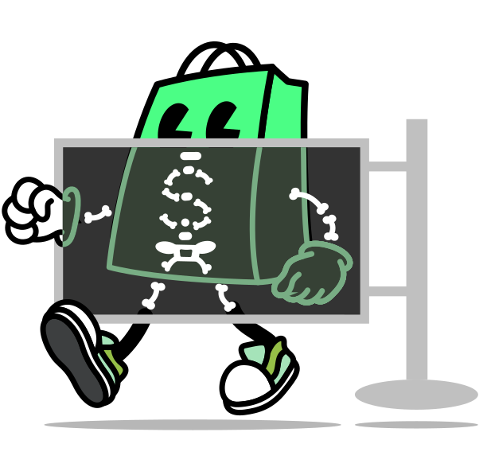

# 🚀 Shopify CJ Dropshipping Automation Suite

<div align="center">



**Professional Shopify & CJ Dropshipping Automation with AI-Powered Store Management**

[](./LICENSE.md)
[](https://nodejs.org/)
[](https://shopify.dev/)

</div>

## ✨ Features

### 🤖 **AI-Powered Store Management**
- **Intelligent Product Upload**: Automated import from CJ Dropshipping with AI optimization
- **SEO Intelligence**: Auto-generated titles, descriptions, and meta tags for maximum visibility
- **Smart Pricing**: Psychological pricing algorithms with competitive markup strategies
- **AI Dashboard**: Beautiful web interface for store management and monitoring

### 🛍️ **Professional E-commerce Tools**
- **Shopify Theme**: Modern, responsive skeleton theme optimized for dropshipping
- **Multi-Market Support**: Global markets setup with proper localization
- **Advanced SEO**: Comprehensive meta tags, schema markup, and performance optimization
- **Product Automation**: Bulk upload, inventory sync, and variant management

### 📊 **Analytics & Monitoring**
- **Real-time Logs**: Comprehensive logging and monitoring system
- **Performance Tracking**: Core Web Vitals and SEO metrics monitoring
- **Error Handling**: Robust error management with detailed reporting
- **Health Monitoring**: System status and API connection monitoring

## 🏗️ Project Structure

```
shopify-automation/
├── 🤖 ai-store-manager/          # AI-powered store management dashboard
│   ├── ai-manager.js             # Main AI manager server
│   ├── dashboard/                # Web dashboard interface
│   └── ai/                       # AI modules and automation
├── ⚙️ automation/                # CJ Dropshipping automation system
│   ├── src/
│   │   ├── commands/             # CLI commands and scripts
│   │   ├── services/             # API services (CJ, Shopify)
│   │   └── utils/                # SEO optimization and utilities
│   └── logs/                     # Automation logs
├── 🎨 assets/                    # Static assets and icons
├── 🧩 blocks/                    # Shopify theme blocks
├── 📝 snippets/                  # Shopify liquid snippets
├── 📄 templates/                 # Shopify page templates
├── 🌍 locales/                   # Multi-language support
└── 📋 docs/                      # Documentation and guides
```

## 🚀 Quick Start

### Prerequisites

- **Node.js 16+** - [Download](https://nodejs.org/)
- **Shopify Store** - [Create Store](https://shopify.com/)
- **CJ Dropshipping Account** - [Sign Up](https://cjdropshipping.com/)

### 1. Installation

```bash
# Clone the repository
git clone https://github.com/Sunzzx/shopify-automation.git
cd shopify-automation

# Install automation dependencies
cd automation
npm install

# Install AI manager dependencies
cd ../ai-store-manager
npm install
```

### 2. Configuration

Create environment files:

```bash
# Copy example files
cp automation/.env.example automation/.env
cp ai-store-manager/.env.example ai-store-manager/.env
```

Configure your API credentials in the `.env` files:

#### Shopify Setup:
1. Go to **Apps > App and sales channel settings > Develop apps**
2. Create custom app with permissions:
   - Products: Read and write
   - Inventory: Read and write
   - Collections: Read and write
3. Add to `.env`:
```bash
SHOPIFY_SHOP_DOMAIN=your-store.myshopify.com
SHOPIFY_ACCESS_TOKEN=your-access-token
```

#### CJ Dropshipping Setup:
1. Login to [CJ Dropshipping](https://cjdropshipping.com)
2. Go to **Account > API Management**
3. Create API credentials and add to `.env`:
```bash
CJ_EMAIL=your-email@example.com
CJ_PASSWORD=your-password
```

### 3. Test Setup

```bash
cd automation
npm run test
```

## 🎯 Usage

### Upload Hoodies (Demo Mode)
```bash
cd automation
npm run demo
```

### Upload Hoodies (Live)
```bash
cd automation
npm run upload-hoodies
```

### Start AI Dashboard
```bash
cd ai-store-manager
npm start
# Open http://localhost:4000
```

## 📊 What Gets Created

### 🎨 **SEO-Optimized Products**

**Professional Titles:**
- Format: "Premium [Product Name] - Hoodie"
- Optimized for 60 characters
- Natural keyword integration

**Compelling Descriptions:**
```
**Experience Ultimate Comfort & Style**

Transform your wardrobe with our premium hoodie...

**What Makes This Special:**
• Premium quality materials for lasting comfort
• Versatile design suitable for layering
• Perfect fit that flatters all body types

**Perfect For:**
• Casual daily wear and weekend relaxation
• Layering during transitional seasons
```

### 💰 **Smart Pricing & Variants**
- **Psychological Pricing**: *.99, *.95 endings
- **Competitive Markup**: 2.5x base cost
- **Size Options**: S, M, L, XL, XXL
- **Color Variants**: Black, White, Gray, Navy

### 🏪 **Professional Collections**
- **Auto-Creation**: "Premium Hoodies & Sweatshirts"
- **SEO URLs**: `/collections/premium-hoodies`
- **Organized Navigation**: Category-based structure

## 📈 Expected Results

### 🎯 **SEO Performance**
- **Traffic Increase**: 20-50% within 3-6 months
- **Ranking Improvement**: Top 3 for long-tail keywords
- **Conversion Boost**: 15-25% improvement

### 🏆 **Store Quality**
- **Professional Appearance**: Store-ready products
- **Complete Information**: All fields properly filled
- **Trust Signals**: Professional policies and descriptions
- **Mobile Optimized**: Responsive design ready

## 🛠️ Commands Reference

### Automation Commands
```bash
npm run demo           # Safe demo upload (no real APIs)
npm run upload-hoodies # Upload 10 hoodies to Shopify
npm run test           # Test API connections
npm run sync-products  # Sync existing products
```

### AI Manager Commands
```bash
npm start              # Start AI dashboard
npm run dev            # Development mode with auto-reload
```

### Shopify Theme Commands
```bash
shopify theme dev      # Preview theme locally
shopify theme push     # Deploy to store
```

## 🔧 API Endpoints

### AI Manager API
- `GET /api/status` - System status
- `POST /api/upload-hoodies` - Upload hoodies
- `GET /api/test-connections` - Test API connections
- `GET /api/logs` - View automation logs
- `POST /api/chat` - AI assistant chat

### Example Usage
```bash
# Upload hoodies via API
curl -X POST http://localhost:4000/api/upload-hoodies \
  -H "Content-Type: application/json" \
  -d '{"mode": "demo", "count": 10}'
```

## 📋 Documentation

- [**Setup Instructions**](./SETUP_INSTRUCTIONS.md) - Detailed setup guide
- [**SEO Optimization Guide**](./SEO_OPTIMIZATION_GUIDE.md) - SEO best practices
- [**Markets Setup**](./MARKETS_SETUP.md) - Multi-market configuration
- [**Development Guide**](./DEVELOPMENT.md) - Development guidelines
- [**Store Connection**](./STORE_CONNECTION.md) - API connection setup

## 🤝 Contributing

1. Fork the repository
2. Create your feature branch (`git checkout -b feature/amazing-feature`)
3. Commit your changes (`git commit -m 'Add amazing feature'`)
4. Push to the branch (`git push origin feature/amazing-feature`)
5. Open a Pull Request

See [CONTRIBUTING.md](./CONTRIBUTING.md) for detailed guidelines.

## 📝 License

This project is licensed under the MIT License - see the [LICENSE.md](./LICENSE.md) file for details.

## 🙏 Acknowledgments

- **Shopify** - E-commerce platform and APIs
- **CJ Dropshipping** - Product sourcing and fulfillment
- **Open Source Community** - Various libraries and tools

## 🆘 Support

### Common Issues

**Authentication Errors:**
- Verify API credentials in `.env` files
- Check Shopify app permissions
- Ensure CJ Dropshipping account access

**Upload Failures:**
- Check internet connection
- Verify API rate limits
- Review automation logs

**SEO Issues:**
- Validate meta tag implementation
- Check image alt text generation
- Verify schema markup

### Getting Help

- 📖 [Documentation](./docs/)
- 🐛 [Report Issues](https://github.com/Sunzzx/shopify-automation/issues)
- 💬 [Discussions](https://github.com/Sunzzx/shopify-automation/discussions)

## 📊 Project Stats

- **Languages**: JavaScript, Liquid, HTML, CSS
- **Frameworks**: Node.js, Express, Shopify Liquid
- **APIs**: Shopify Admin API, CJ Dropshipping API
- **Features**: 50+ automation features
- **SEO Tools**: Advanced optimization suite

---

<div align="center">

**Made with ❤️ for the Shopify & Dropshipping Community**

[⭐ Star this repo](https://github.com/Sunzzx/shopify-automation) | [🐛 Report Bug](https://github.com/Sunzzx/shopify-automation/issues) | [💡 Request Feature](https://github.com/Sunzzx/shopify-automation/issues)

</div>
├── config          # Global theme settings and customization options
├── layout          # Top-level wrappers for pages (layout templates)
├── locales         # Translation files for theme internationalization
├── sections        # Modular full-width page components
├── snippets        # Reusable Liquid code or HTML fragments
└── templates       # Templates combining sections to define page structures
```

To learn more, refer to the [theme architecture documentation](https://shopify.dev/docs/storefronts/themes/architecture).

### Templates

[Templates](https://shopify.dev/docs/storefronts/themes/architecture/templates#template-types) control what's rendered on each type of page in a theme.

The Skeleton Theme scaffolds [JSON templates](https://shopify.dev/docs/storefronts/themes/architecture/templates/json-templates) to make it easy for merchants to customize their store.

None of the template types are required, and not all of them are included in the Skeleton Theme. Refer to the [template types reference](https://shopify.dev/docs/storefronts/themes/architecture/templates#template-types) for a full list.

### Sections

[Sections](https://shopify.dev/docs/storefronts/themes/architecture/sections) are Liquid files that allow you to create reusable modules of content that can be customized by merchants. They can also include blocks which allow merchants to add, remove, and reorder content within a section.

Sections are made customizable by including a `` in the body. For more information, refer to the [section schema documentation](https://shopify.dev/docs/storefronts/themes/architecture/sections/section-schema).

### Blocks

[Blocks](https://shopify.dev/docs/storefronts/themes/architecture/blocks) let developers create flexible layouts by breaking down sections into smaller, reusable pieces of Liquid. Each block has its own set of settings, and can be added, removed, and reordered within a section.

Blocks are made customizable by including a `` in the body. For more information, refer to the [block schema documentation](https://shopify.dev/docs/storefronts/themes/architecture/blocks/theme-blocks/schema).

## Schemas

When developing components defined by schema settings, we recommend these guidelines to simplify your code:

- **Single property settings**: For settings that correspond to a single CSS property, use CSS variables:

  ```liquid
  <div class="collection" style="--gap: {{ block.settings.gap }}px">
    ...
  </div>

  
    .collection {
      gap: var(--gap);
    }
  

  
  {
    "settings": [{
      "type": "range",
      "label": "gap",
      "id": "gap",
      "min": 0,
      "max": 100,
      "unit": "px",
      "default": 0,
    }]
  }
  
  ```

- **Multiple property settings**: For settings that control multiple CSS properties, use CSS classes:

  ```liquid
  <div class="collection {{ block.settings.layout }}">
    ...
  </div>

  
    .collection--full-width {
      /* multiple styles */
    }
    .collection--narrow {
      /* multiple styles */
    }
  

  
  {
    "settings": [{
      "type": "select",
      "id": "layout",
      "label": "layout",
      "values": [
        { "value": "collection--full-width", "label": "t:options.full" },
        { "value": "collection--narrow", "label": "t:options.narrow" }
      ]
    }]
  }
  
  ```

## CSS & JavaScript

For CSS and JavaScript, we recommend using the [``](https://shopify.dev/docs/api/liquid/tags#stylesheet) and [``](https://shopify.dev/docs/api/liquid/tags/javascript) tags. They can be included multiple times, but the code will only appear once.

### `critical.css`

The Skeleton Theme explicitly separates essential CSS necessary for every page into a dedicated `critical.css` file.

## Contributing

We're excited for your contributions to the Skeleton Theme! This repository aims to remain as lean, lightweight, and fundamental as possible, and we kindly ask your contributions to align with this intention.

Visit our [CONTRIBUTING.md](./CONTRIBUTING.md) for a detailed overview of our process, guidelines, and recommendations.

## License

Skeleton Theme is open-sourced under the [MIT](./LICENSE.md) License.
